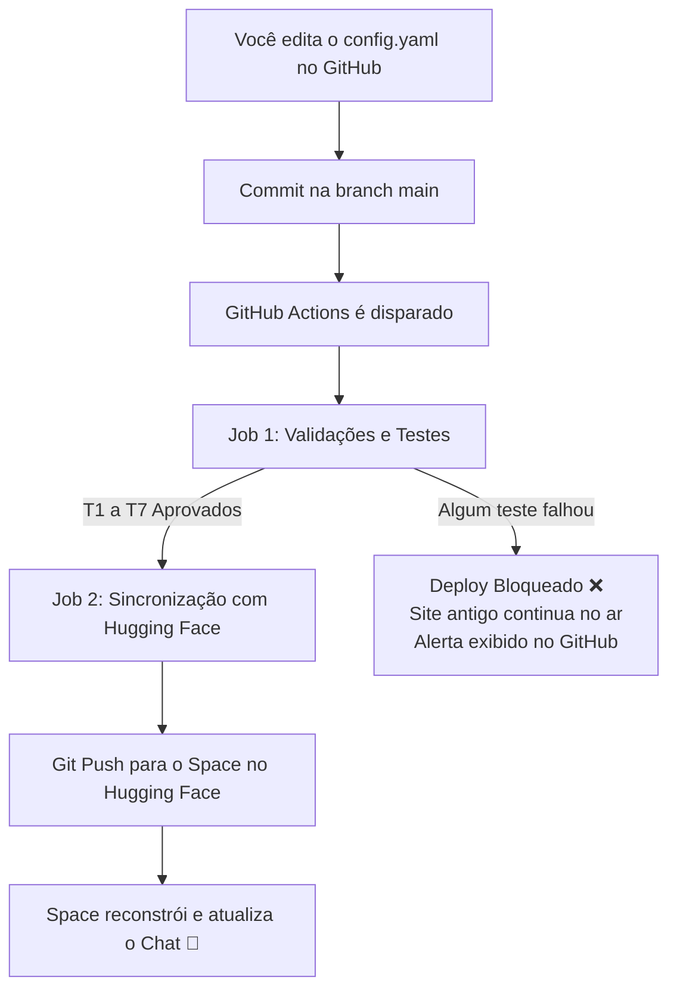

# Especificação Técnica — Parte 1: Assistente de IA Didático com CI/CD e Deploy no Hugging Face Spaces

> **Documento de Especificação (Spec-Driven)**  
> **Projeto:** Chat-AI Personalizado  
> **Versão:** 1.0.0  
> **Repositório GitHub:** `BestWi11/chat-ai`  
> **Hugging Face Space:** `BestWill/chat-ai-personalizado`  
> **Status:** Proposta para Aprovação  

---

## 1. Objetivo, Público e Escopo

### 1.1 Objetivo do Projeto
Construir e publicar na internet um assistente conversacional inteligente com foco pedagógico, projetado para tirar dúvidas sobre **Engenharia de Dados** e **Inteligência Artificial** com explicações claras, didáticas e acessíveis para estudantes. O sistema é 100% personalizável através de um único arquivo de configuração (`config.yaml`), sem necessidade de alteração de código para trocar identidade, regras de conduta, cores ou modelos de IA.

### 1.2 Público-Alvo
- **Usuários Finais (Alunos):** Estudantes e entusiastas que interagem pelo navegador sem necessidade de login.
- **Mantenedor (Professor/Administrador):** Pessoa que gerencia o assistente editando diretamente o `config.yaml` pela interface web do GitHub.

### 1.3 Divisão de Escopo (Roadmap)
- **Parte 1 (Escopo Atual):**
  - Interface de Chat Web interativa em Gradio, fluida e com streaming de texto em tempo real.
  - Integração prioritária com o provedor **OpenRouter** (modelo gratuito padrão: `meta-llama/llama-3.3-70b-instruct:free`).
  - Suporte a múltiplos provedores e chave de fallback (OpenRouter -> OpenAI -> Anthropic) caso um modelo esteja fora do ar ou sem cota.
  - Relatório didático de erro na tela caso todos os provedores falhem.
  - Personalização dinâmica completa via `config.yaml` (identidade, cores, logo, sugestões de perguntas, prompt de sistema).
  - Portão de qualidade e testes automatizados (CI) para impedir publicação de configurações inválidas ou vazamento de chaves.
  - Pipeline de entrega contínua (CD) via GitHub Actions sincronizando automaticamente com o Hugging Face Spaces.
  - Interface e mensagens 100% em Português do Brasil (PT-BR).

- **Parte 2 (Futuro - Não entra agora):**
  - Mecanismo de RAG (Retrieval-Augmented Generation) com base de conhecimento baseada em documentos próprios (PDFs, apostilas, códigos).

- **Parte 3 (Futuro - Não entra agora):**
  - Domínio próprio personalizado, frontend desacoplado (Next.js/React), login de alunos e persistência de histórico de conversas em banco de dados.

---

## 2. Stack Tecnológica e Restrições da Plataforma

### 2.1 Stack Escolhida
- **Linguagem:** Python 3.10+
- **Framework de Interface Web:** [Gradio](https://www.gradio.app/) (`gradio>=4.0.0`) — Framework nativo do ecossistema Hugging Face, com suporte robusto a streaming de chat e injeção de CSS/temas.
- **Validação de Configuração:** [Pydantic v2](https://docs.pydantic.dev/) + PyYAML — Garantem validação estrita de tipos, faixas de valores e integridade do contrato.
- **Integração com Modelos de IA:**
  - `openai` Python SDK (usado tanto para o **OpenRouter** via `base_url="https://openrouter.ai/api/v1"` quanto para **OpenAI**).
  - `anthropic` Python SDK (para modelos Claude).
- **Testes Automatizados:** `pytest` + scripts de validação dedicados.
- **Automação e CI/CD:** GitHub Actions.
- **Hospedagem:** Hugging Face Spaces (Hardware: `CPU basic - Free Tier`).

### 2.2 Restrições Conhecidas do Hugging Face Spaces
1. **Container Efêmero (Stateless):** Arquivos salvos em disco durante a execução do chat são perdidos caso o Space reinicie. Toda a configuração estática deve estar no repositório.
2. **Porta Padrão:** A aplicação deve obrigatoriamente escutar na porta `7860` ou usar o binding padrão do Gradio (`app.launch(server_name="0.0.0.0", server_port=7860)`).
3. **Inatividade (Sleep Mode no plano gratuito):** Spaces no plano gratuito entram em suspensão após períodos de inatividade. O cold start leva alguns segundos ao ser acessado novamente.
4. **Segurança de Variáveis de Ambiente:** Nenhuma chave (`OPENROUTER_API_KEY`, `OPENAI_API_KEY`, etc.) pode ser gravada no código. As chaves devem ser configuradas na aba **Settings > Variables and secrets** do Space no Hugging Face.

---

## 3. Estrutura de Arquivos do Projeto

```text
chat-ai/
├── .github/
│   └── workflows/
│       └── deploy.yml              # Pipeline GitHub Actions (Validação + Sincronização com HF)
├── .llm/
│   └── parte-01/
│       ├── IDEIA-parte1.md         # Documento com a concepção inicial do projeto
│       └── SPEC-parte1-cicd-deploy.md # Esta especificação técnica detalhada
├── assets/
│   └── logo.png                    # Imagem de logo exibida no topo do chat
├── src/
│   ├── __init__.py
│   ├── config_loader.py            # Validador e carregador Pydantic do config.yaml
│   ├── llm_client.py               # Orquestrador de requisições e fallback entre IA/Provedores
│   └── ui.py                       # Construção da interface Gradio e aplicação do tema
├── tests/
│   ├── __init__.py
│   ├── test_config.py              # Testes automatizados da integridade do config.yaml
│   └── test_security.py            # Testes anti-vazamento de credenciais e chaves
├── app.py                          # Ponto de entrada (entrypoint) executado pelo Hugging Face Space
├── config.yaml                     # Arquivo ÚNICO de configuração do assistente
├── validate_config.py              # Script executável do portão de testes (usado no CI e local)
├── requirements.txt                # Dependências do projeto Python
├── .gitignore                      # Arquivos ignorados pelo Git (.env, caches, venv)
└── README.md                       # Metadados do Space (YAML frontmatter) e instruções
```

---

## 4. Contrato do Arquivo de Configuração (`config.yaml`)

O arquivo `config.yaml` na raiz do projeto é a fonte da verdade para toda a personalização do assistente.

### 4.1 Exemplo Completo do Arquivo

```yaml
app:
  title: "Professor IA — Engenharia de Dados & IA"
  description: "Tire suas dúvidas sobre pipelines, SQL, Python, machine learning e arquitetura de dados de forma didática."
  logo_path: "assets/logo.png"
  logo_width: 80

theme:
  primary_color: "#1E3A8A"     # Azul escuro sofisticado
  secondary_color: "#3B82F6"   # Azul vibrante
  background_color: "#0F172A"  # Fundo escuro elegante
  text_color: "#F8FAFC"        # Texto claro

llm:
  timeout_seconds: 30
  providers:
    - name: "openrouter"
      model: "meta-llama/llama-3.3-70b-instruct:free"
      max_tokens: 1024
      temperature: 0.7
    - name: "openai"
      model: "gpt-4o-mini"
      max_tokens: 1024
      temperature: 0.7
    - name: "anthropic"
      model: "claude-3-5-haiku-latest"
      max_tokens: 1024
      temperature: 0.7

system_prompt:
  role: "Você é um professor tutor especialista e muito paciente de Engenharia de Dados e Inteligência Artificial."
  tone: "Didático, encorajador, claro, usando exemplos práticos e analogias do mundo real quando apropriado."
  restrictions:
    - "Nunca responda a conteúdos ofensivos, preconceituosos ou antiéticos."
    - "Se a pergunta for totalmente fora do escopo de tecnologia, computação, dados ou IA, redirecione o aluno educadamente para o tema de estudos."
    - "Não gere respostas excessivamente longas sem necessidade; estruture tópicos com listas e negrito para facilitar o estudo."
  custom_instructions: "Sempre que apresentar um comando ou código SQL/Python, comente brevemente as linhas principais."

example_questions:
  - "Qual a diferença prática entre Data Lake e Data Warehouse?"
  - "Como funciona um pipeline ETL e quando usar ELT?"
  - "O que é Overfitting em Machine Learning e como evitar?"
  - "Explique o que faz um vetor embedding de forma simples."
```

### 4.2 Tabela de Campos e Regras do Contrato

| Campo | Tipo | Obrigatório? | Valores Aceitos / Validação | Valor Padrão |
|---|---|---|---|---|
| `app.title` | `string` | Sim | Texto não vazio (1 a 100 caracteres) | — |
| `app.description` | `string` | Sim | Texto não vazio (1 a 300 caracteres) | — |
| `app.logo_path` | `string` | Não | Caminho relativo válido para arquivo existente (`.png`, `.jpg`, `.svg`) | `""` |
| `app.logo_width` | `integer` | Não | Número inteiro entre 20 e 400 pixels | `80` |
| `theme.primary_color` | `string` | Sim | Cor hexadecimal válida no formato `#RRGGBB` ou `#RGB` | `#2563EB` |
| `theme.secondary_color` | `string` | Não | Cor hexadecimal válida no formato `#RRGGBB` ou `#RGB` | `#3B82F6` |
| `theme.background_color` | `string` | Não | Cor hexadecimal válida no formato `#RRGGBB` | `#0F172A` |
| `theme.text_color` | `string` | Não | Cor hexadecimal válida no formato `#RRGGBB` | `#F8FAFC` |
| `llm.timeout_seconds` | `integer` | Não | Entre 5 e 120 segundos | `30` |
| `llm.providers` | `list` | Sim | Lista com pelo menos 1 provedor configurado | — |
| `llm.providers[].name` | `string` | Sim | Um dos valores: `openrouter`, `openai`, `anthropic` | — |
| `llm.providers[].model` | `string` | Sim | Nome de identificação do modelo no provedor | — |
| `llm.providers[].max_tokens` | `integer` | Não | Entre 64 e 4096 tokens | `1024` |
| `llm.providers[].temperature`| `float` | Não | Entre `0.0` (determinístico) e `1.0` (criativo) | `0.7` |
| `system_prompt.role` | `string` | Sim | Texto não vazio | — |
| `system_prompt.tone` | `string` | Sim | Texto não vazio | — |
| `system_prompt.restrictions`| `list[str]`| Não | Lista de strings | `[]` |
| `system_prompt.custom_instructions`| `string`| Não | Texto com instruções adicionais | `""` |
| `example_questions` | `list[str]` | Não | Lista de até 6 perguntas curtas | `[]` |

---

## 5. Requisitos Funcionais

- **RF1 (Carregamento de Configuração):** O sistema deve carregar e validar o arquivo `config.yaml` no momento da inicialização. Caso ocorra erro, a inicialização é abortada com log detalhado em português.
- **RF2 (Interface Amigável e Responsiva):** A interface web Gradio deve exibir no cabeçalho o logotipo (se configurado), o título e a descrição do assistente.
- **RF3 (Streaming de Respostas):** As respostas geradas pela IA devem ser enviadas ao chat de forma progressiva (efeito digitação/streaming), garantindo sensação de rapidez e interatividade.
- **RF4 (Mecanismo de Fallback de Provedores):** Quando o usuário envia uma mensagem, o sistema tenta o primeiro provedor configurado em `llm.providers`. Se o provedor falhar (ex.: erro 429 de limite atingido, 401 de chave ausente, modelo offline ou timeout), o sistema tenta imediatamente o próximo provedor da lista, de forma transparente para o aluno.
- **RF5 (Relatório Didático de Falha Total):** Se todos os provedores da lista falharem, o chat não deve quebrar com uma tela em branco ou erro de código: deve exibir uma mensagem amigável no chat listando os motivos de falha de cada provedor testado.
- **RF6 (Perguntas de Exemplo Clicáveis):** As perguntas definidas em `example_questions` devem aparecer como botões de sugestão. Ao clicar em uma sugestão, o texto deve ser inserido automaticamente na caixa de mensagem ou enviado direto ao chat.
- **RF7 (Injeção de System Prompt Pedagógico):** Cada conversa deve iniciar injetando as instruções de papel (`role`), tom (`tone`), restrições e instruções customizadas definidas na configuração.
- **RF8 (Segurança e Ocultação de Chaves):** Nenhuma chave de API ou segredo de infraestrutura deve ser retornado para o navegador do cliente em nenhuma hipótese.
- **RF9 (Compatibilidade com Hugging Face):** O arquivo de entrada `app.py` deve iniciar o servidor Gradio escutando na porta `7860` e host `0.0.0.0`.
- **RF10 (Execução Local Facilitada):** Em ambiente local de desenvolvimento, o sistema deve suportar a leitura de variáveis de ambiente através de um arquivo `.env` (ignorado pelo Git).

---

## 6. Verificações do Portão de Testes (Quality Gate)

O portão de testes é executado em duas ocasiões: localmente antes do commit e automaticamente na pipeline do GitHub Actions. Se qualquer uma das verificações falhar, o deploy para o Hugging Face Spaces é **imediatamente cancelado**.

- **T1 (Sintaxe YAML):** Verifica se o arquivo `config.yaml` é um YAML válido e bem formatado.
- **T2 (Validação de Schema Pydantic):** Valida tipos de dados, campos obrigatórios e limites numéricos de todos os nós de configuração.
- **T3 (Validação de Cores HEX):** Garante que todas as cores fornecidas no bloco `theme` seguem o padrão `#RGB` ou `#RRGGBB`.
- **T4 (Existência de Assets):** Se `app.logo_path` for preenchido, verifica se o arquivo realmente existe no repositório.
- **T5 (Anti-Vazamento de Segredos - Leak Prevention):** Escaneia os arquivos do repositório procurando por padrões comuns de API Keys (ex: `sk-`, `sk-or-`, `ant-api`, `hf_`). Caso encontre chaves hardcoded no código, a esteira falha.
- **T6 (Teste Unitário do Fallback):** Simula falha do primeiro provedor e valida se o orquestrador aciona o segundo provedor corretamente.
- **T7 (Teste de Smoke da UI):** Testa se a função construtora do Gradio inicializa a árvore de componentes sem levantar exceções.

---

## 7. Pipeline de Deploy com GitHub Actions e Configurações Manuais

### 7.1 Como Funciona a Pipeline Automática



### 7.2 Configurações Manuais Necessárias (Passo a Passo)

#### Passo 1: No Hugging Face
1. Faça login em [huggingface.co](https://huggingface.co/).
2. Crie um novo Space:
   - **Space Name:** `chat-ai-personalizado`
   - **License:** `apache-2.0` ou `mit`
   - **SDK:** `Gradio`
   - **Space hardware:** `CPU basic • 2 vCPU • 16GB • Free`
   - **Visibility:** `Public`
3. Crie um Token de Acesso com permissão de escrita:
   - Acesse **Settings > Access Tokens** (`https://huggingface.co/settings/tokens`).
   - Clique em **Create new token**, escolha o tipo **Write** e dê o nome `github-actions-deploy`. Copie o token gerado (`hf_...`).
4. Configure as chaves de API das IAs no Space:
   - No seu Space recém-criado, vá em **Settings > Variables and secrets**.
   - Adicione os Secrets:
     - `OPENROUTER_API_KEY`: sua chave do OpenRouter.
     - `OPENAI_API_KEY` (opcional): sua chave da OpenAI.
     - `ANTHROPIC_API_KEY` (opcional): sua chave da Anthropic.

#### Passo 2: No GitHub
1. No seu repositório `BestWi11/chat-ai`, vá em **Settings > Secrets and variables > Actions**.
2. Clique em **New repository secret** e adicione:
   - **Name:** `HF_TOKEN`
   - **Secret:** Cole o token de escrita do Hugging Face (`hf_...`) gerado no passo anterior.

---

## 8. Critérios de Aceite (Checklist de Validação)

- [ ] **Configuração Sem Código:** O assistente pode ser completamente reconfigurado (título, cores, instruções, modelos) apenas editando o `config.yaml`.
- [ ] **Chat com Streaming:** Mensagens enviadas ao chat são respondidas em fluxo contínuo (streaming) em português.
- [ ] **Comportamento Didático:** O assistente responde com tom encorajador, estruturado e seguindo as instruções de professor de Engenharia de Dados e IA.
- [ ] **Resiliência Multi-Provedor:** Se a chave ou modelo principal falhar, o sistema usa o próximo provedor configurado sem travar a interface.
- [ ] **Portão Ativo:** Se uma cor for digitada errada (ex: `azul` em vez de `#0000FF`) ou um campo obrigatório for apagado no `config.yaml`, o GitHub Actions falha e impede o deploy.
- [ ] **Segurança Garantida:** Nenhuma chave de API está presente no histórico ou arquivos do GitHub.
- [ ] **Deploy Automático:** Ao fazer commit na branch `main`, a alteração é refletida no Hugging Face Space em poucos minutos.

---

## 9. Ordem das Tarefas de Implementação

As tarefas serão executadas estritamente de forma sequencial na fase de implementação:

1. **Tarefa 1: Estrutura Base e Dependências**
   - Criar arquivo `.gitignore`, `requirements.txt` e `README.md` com cabeçalho de metadados do Hugging Face Space.
2. **Tarefa 2: Contrato e Validador de Configuração**
   - Criar o `config.yaml` inicial.
   - Implementar `src/config_loader.py` utilizando Pydantic para validação das regras.
3. **Tarefa 3: Portão de Testes e Script de Validação**
   - Criar o script executável `validate_config.py`.
   - Implementar a suíte de testes unitários em `tests/test_config.py` e `tests/test_security.py`.
4. **Tarefa 4: Cliente LLM com Fallback e Streaming**
   - Implementar `src/llm_client.py` integrando OpenRouter, OpenAI e Anthropic com alternância inteligente de provedores e geradores de streaming.
5. **Tarefa 5: Interface Visual com Gradio**
   - Implementar `src/ui.py` montando o layout com cabeçalho, logo (`assets/logo.png`), botões de sugestão e chat com streaming.
6. **Tarefa 6: Entrypoint Raiz**
   - Criar `app.py` na raiz para instanciar o app e escutar na porta 7860.
7. **Tarefa 7: Pipeline de CI/CD**
   - Criar `.github/workflows/deploy.yml` com as etapas de verificação e deploy seguro para o Hugging Face.
8. **Tarefa 8: Teste Integrado e Publicação Inicial**
   - Executar bateria de testes local e guiar a conexão inicial com o Hugging Face Spaces.

---

## 10. Erros Comuns e Como Resolver

| Erro / Sintoma | Causa Mais Provável | Solução Passo a Passo |
|---|---|---|
| **Pipeline do GitHub falha com `ValidationError`** | Um campo obrigatório foi apagado ou uma cor foi digitada sem `#` no `config.yaml`. | Abra a aba **Actions** no GitHub, veja a mensagem de erro que aponta a linha exata e corrija no `config.yaml`. |
| **Pipeline falha com `Secret Leak Detected`** | Uma chave de API real foi digitada no `config.yaml` ou em algum arquivo de código. | Remova a chave do arquivo, garanta que ela esteja apenas nos **Secrets** do Hugging Face e faça um novo commit. |
| **Space no Hugging Face mostra `Runtime Error`** | A variável `OPENROUTER_API_KEY` não foi cadastrada nos Secrets do Space. | Acesse o Space > **Settings > Variables and secrets** e adicione o secret `OPENROUTER_API_KEY`. |
| **GitHub Action falha com `403 Forbidden` no push para o HF** | O `HF_TOKEN` nas Secrets do GitHub é inválido ou tem apenas permissão de leitura (`read`). | Gere um novo token no Hugging Face com permissão **Write** e atualize o secret `HF_TOKEN` no GitHub. |
| **Chat responde com mensagem de limite atingido (429)** | O modelo gratuito do OpenRouter está com tráfego muito alto no momento. | O fallback tentará o próximo provedor automaticamente. Você também pode trocar o modelo no `config.yaml` por outro modelo disponível no OpenRouter. |
