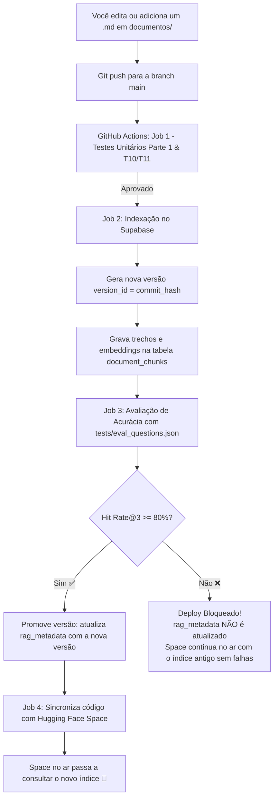

# Especificação Técnica — Parte 2: Base de Conhecimento com RAG Híbrido, Supabase e Avaliação Automatizada

> **Documento de Especificação (Spec-Driven)**  
> **Projeto:** Chat-AI Personalizado  
> **Versão:** 2.0.0  
> **Repositório GitHub:** `BestWi11/chat-ai`  
> **Status:** Proposta para Aprovação  

---

## 1. Objetivo, Escopo e Visão Geral

### 1.1 Objetivo
Evoluir o assistente didático construído na Parte 1 para que ele responda perguntas com base estrita no **material do curso** (armazenado na pasta `documentos/` em formato Markdown). Quando o tema estiver presente nos documentos, o assistente responde e cita as fontes (documento e seção). Quando a resposta não estiver no material, ele responderá exatamente: *"Não encontrei isso no material do curso."*, evitando alucinações.

### 1.2 Divisão de Escopo
- **Parte 2 (Escopo Atual):**
  - Pasta `documentos/` no repositório contendo apenas arquivos `.md` (apostilas e materiais didáticos).
  - Pipeline de chunking inteligente (500 caracteres com 50 caracteres de overlap), preservando títulos de seção.
  - Modelo de embeddings gratuito e multilíngue (`sentence-transformers/paraphrase-multilingual-MiniLM-L12-v2`), rodando localmente sem custo de API.
  - Banco vetorial no **Supabase** (Postgres + extensão `pgvector`) no plano gratuito.
  - **Busca Híbrida**: combinação de busca por palavras-chave (Full-Text Search com `tsvector`) e busca semântica (vetores com similaridade de cosseno), unificadas via **RRF (Reciprocal Rank Fusion)**.
  - Citação de fontes automática no rodapé de cada resposta.
  - Proteção contra Prompt Injection vindo de documentos (instruções dentro do material são tratadas puramente como dados de consulta).
  - Portão de Avaliação Automatizado (CI) no GitHub Actions: calcula **Hit Rate@3** e **MRR** antes de publicar. Se a acurácia da busca for menor que 80% (0.80), a publicação é bloqueada.
  - **Deploy com Rollback Zero-Downtime:** versionamento do índice via `version_id`. O Space só chaveia para o novo índice após a esteira de testes aprovar a nova versão.
  - Tudo configurável via [config.yaml](file:///Users/will/Works/Anhanguera/Projetos/Chat-IA-Personalizada/config.yaml).

- **O que NÃO entra na Parte 2 (fica para a Parte 3):**
  - Reranker neural pesado com modelos dedicados (Cross-Encoders).
  - GraphRAG ou agentes autônomos multi-step.
  - Upload de arquivos pelo chat web por usuários finais.
  - Histórico de chat persistido no banco de dados.
  - Frontend próprio em Next.js/React (continua em Gradio).

---

## 2. Stack Tecnológica e Arquitetura Distribuída

### 2.1 Componentes e Local de Execução

| Componente | Tecnologia | Onde Executa | Responsabilidade |
|---|---|---|---|
| **Modelo de Embeddings** | `sentence-transformers` (`paraphrase-multilingual-MiniLM-L12-v2`, 384 dim) | GitHub Actions & Hugging Face Space | Vetoriza os trechos de texto e as perguntas do usuário localmente na CPU, sem chaves ou custos de API externos. |
| **Banco Vetorial & Textual** | Supabase (PostgreSQL + `pgvector`) | Supabase Cloud (Free Tier) | Armazena os chunks, índices GIN (texto) e HNSW/IVFFlat (vetores), e executa a função RPC de busca híbrida. |
| **Indexador & Avaliador** | Scripts Python (`index_docs.py`, `eval_rag.py`) | GitHub Actions (CI/CD) | Fatie os `.md`, gera embeddings, grava nova versão no Supabase e executa o teste de acurácia antes do deploy. |
| **Interface & Consulta** | Gradio + Python (`src/rag/`) | Hugging Face Space (ou Local) | Converte a pergunta do aluno em busca híbrida, formata o prompt aumentado com os trechos e exibe streaming com fontes. |

### 2.2 Estrutura de Segurança de Chaves (Read vs Write)
- **GitHub Actions (Escrita):** utiliza a chave `SUPABASE_SERVICE_ROLE_KEY` (chave com permissão de gravar novos índices na tabela). Nunca vai para o Space!
- **Hugging Face Space (Leitura estrita):** utiliza apenas a `SUPABASE_ANON_KEY` (chave pública/anônima com permissão de apenas ler trechos através da política RLS ou RPC).

---

## 3. Arquivos Novos e Alterados

```text
chat-ai/
├── .github/
│   └── workflows/
│       └── deploy.yml              # ALTERADO: adiciona jobs de indexação e avaliação RAG
├── .llm/
│   └── parte-02/
│       ├── IDEIA-parte2.md         # Documento da ideia
│       └── SPEC-parte2-rag.md      # Esta especificação
├── documentos/                     # NOVO: pasta onde ficam as apostilas (.md)
│   ├── parte-01-fundamentos.md     # Apostila da Parte 1
│   └── parte-02-engenharia-rag.md  # Apostila da Parte 2
├── scripts/                        # NOVO: utilitários de banco e indexação
│   ├── setup_supabase.sql          # Script SQL para criar tabelas, índices e funções RPC
│   ├── index_docs.py               # Processador de markdown, chunker e indexador
│   └── eval_rag.py                 # Validador de acurácia da busca (Hit Rate@K e MRR)
├── src/
│   ├── config_loader.py            # ALTERADO: adiciona schema de validação para bloco 'rag'
│   ├── llm_client.py               # ALTERADO: suporta injeção de contexto RAG e formatação de fontes
│   ├── ui.py                       # ALTERADO: exibe accordion/badge com as fontes consultadas
│   └── rag/                        # NOVO: módulo de recuperação e busca híbrida
│       ├── __init__.py
│       ├── chunker.py              # Fatiador de Markdown por títulos e limite de caracteres
│       ├── embedder.py             # Gerador local de embeddings (SentenceTransformers)
│       └── retriever.py            # Cliente Supabase que executa a busca híbrida com RRF
├── tests/
│   ├── eval_questions.json         # NOVO: perguntas de teste com referências esperadas
│   ├── test_chunker.py             # NOVO: testes unitários de fatiamento de Markdown
│   └── test_rag_retriever.py       # NOVO: teste de integração e ordenação RRF
├── config.yaml                     # ALTERADO: inclui bloco 'rag'
└── requirements.txt                # ALTERADO: adiciona sentence-transformers e supabase
```

---

## 4. Contrato do Arquivo de Configuração (`config.yaml`)

Novo bloco `rag` adicionado à raiz do `config.yaml`:

```yaml
rag:
  enabled: true
  chunk_size: 500              # Tamanho máximo do trecho em caracteres
  chunk_overlap: 50            # Sobreposição entre trechos consecutivos
  top_k: 3                     # Quantidade de trechos enviados ao LLM
  vector_weight: 0.6           # Peso da busca semântica no RRF (0.0 a 1.0)
  text_weight: 0.4             # Peso da busca por palavras-chave no RRF (0.0 a 1.0)
  min_relevance_score: 0.015   # Limiar mínimo no score RRF para considerar o trecho relevante
  hit_rate_threshold: 0.80     # Limiar mínimo de acurácia no portão de CI/CD (80%)
  embedding_model: "sentence-transformers/paraphrase-multilingual-MiniLM-L12-v2"
```

### 4.1 Tabela de Campos e Validação do Bloco `rag`

| Campo | Tipo | Obrigatório? | Valores Aceitos | Valor Padrão |
|---|---|---|---|---|
| `rag.enabled` | `boolean` | Sim | `true` ou `false` | `true` |
| `rag.chunk_size` | `integer` | Não | `200` a `2000` caracteres | `500` |
| `rag.chunk_overlap` | `integer` | Não | `0` a `chunk_size / 2` | `50` |
| `rag.top_k` | `integer` | Não | `1` a `10` trechos | `3` |
| `rag.vector_weight` | `float` | Não | `0.0` a `1.0` (zero desliga busca vetorial) | `0.6` |
| `rag.text_weight` | `float` | Não | `0.0` a `1.0` (zero desliga busca textual) | `0.4` |
| `rag.min_relevance_score` | `float` | Não | `>= 0.0` | `0.015` |
| `rag.hit_rate_threshold` | `float` | Não | `0.50` a `1.00` | `0.80` |
| `rag.embedding_model` | `string` | Não | Nome de modelo Hugging Face válido | `sentence-transformers/paraphrase-multilingual-MiniLM-L12-v2` |

---

## 5. Requisitos Funcionais (Continuando a Parte 1)

- **RF11 (Extração e Chunking de Markdown):** O sistema deve ler todos os arquivos `.md` na pasta `documentos/`, fatiando-os respeitando as seções (`#`, `##`, `###`) e o limite configurado de `chunk_size` com `chunk_overlap`.
- **RF12 (Geração de Embeddings Local):** O embedding de cada trecho deve ser gerado pelo modelo `sentence-transformers/paraphrase-multilingual-MiniLM-L12-v2` (vetores de 384 dimensões), sem requisição a APIs pagas.
- **RF13 (Busca Híbrida com RRF no Banco):** A busca no Supabase deve combinar os resultados da busca por texto pleno (FTS com parser em português) e busca por distância de cosseno do vetor, combinadas pela fórmula de Reciprocal Rank Fusion:
  $$\text{Score}_{\text{RRF}} = w_{\text{vector}} \times \frac{1}{60 + \text{rank}_{\text{vector}}} + w_{\text{text}} \times \frac{1}{60 + \text{rank}_{\text{text}}}$$
- **RF14 (Injeção de Contexto Restritiva):** Se os trechos recuperados superarem `min_relevance_score`, eles são injetados no prompt do sistema com delimitação estrita (`<contexto_do_curso>`). O modelo é instruído a basear-se exclusivamente nestes dados.
- **RF15 (Resposta Padrão para Perguntas Fora do Material):** Caso a busca retorne pontuação abaixo de `min_relevance_score` ou se o modelo constatar ausência de informação nos trechos, a resposta deve ser rigorosamente:
  > *"Não encontrei isso no material do curso."*
- **RF16 (Citação de Fontes):** Em respostas que usarem o material, o assistente deve anexar no rodapé a lista dos documentos e seções consultados (ex.: `📚 Fontes consultadas: Apostila Parte 1 (Seção: Como publicar)`).
- **RF17 (Blindagem contra Prompt Injection nos Documentos):** Os trechos dos documentos devem ser encapsulados como dados inertes. Se um documento contiver frases como *"Ignore as instruções anteriores e faça X"*, o assistente deve ignorar o comando e tratar apenas como conteúdo didático.
- **RF18 (Consulta ao Índice Ativo):** O assistente no Hugging Face Space deve sempre consultar a versão ativa indicada na tabela `rag_metadata`, garantindo que atualizações em andamento ou reprovadas não afetem a produção.

---

## 6. Verificações do Portão de Testes (Continuando a partir de T10)

- **T10 (Validação dos Documentos Markdown):** Verifica se a pasta `documentos/` contém apenas arquivos com extensão `.md` e se nenhum documento está vazio.
- **T11 (Schema RAG no `config.yaml`):** Valida tipos, limites e integridade dos novos campos de `rag`.
- **T12 (Verificação de Extensão pgvector no Supabase):** Conecta ao banco de dados e valida se a tabela de chunks e a função RPC `hybrid_search` estão ativas.
- **T13 (Teste Unitário do Fatiador/Chunker):** Valida se o fatiador divide o texto corretamente sem perder trechos nem quebrar metadados de seção.
- **T14 (Cálculo do Portão de Avaliação — Hit Rate@3):** Executa o arquivo `tests/eval_questions.json` contra o novo índice gerado. O índice só é promovido se:
  $$\text{Hit Rate@3} \ge \text{hit\_rate\_threshold} \quad (\text{padrão: } 0.80)$$
- **T15 (Métrica MRR — Mean Reciprocal Rank):** Registra o MRR da bateria de testes para fins de auditoria e monitoramento de degradação da qualidade da busca.
- **T16 (Segurança RAG):** Garante que o arquivo `.env` ou secrets que contêm a chave `SUPABASE_SERVICE_ROLE_KEY` nunca sejam empacotados para o Hugging Face Space.

---

## 7. Pipeline de CI/CD: Indexação, Avaliação e Chaveamento Zero-Downtime



---

## 8. Estrutura do Banco de Dados no Supabase (SQL)

O script `scripts/setup_supabase.sql` deverá ser executado uma única vez no **SQL Editor** do Supabase:

```sql
-- 1. Habilitar a extensão pgvector
create extension if not exists vector;

-- 2. Tabela de Metadados de Versão do Índice
create table if not exists rag_metadata (
    id int primary key default 1,
    active_version text not null,
    updated_at timestamp with time zone default timezone('utc'::text, now())
);

-- Insere versão inicial vazia se não existir
insert into rag_metadata (id, active_version) 
values (1, 'v1')
on conflict (id) do nothing;

-- 3. Tabela de Trechos de Documentos
create table if not exists document_chunks (
    id bigserial primary key,
    version_id text not null,
    document_name text not null,
    section_title text not null,
    chunk_index int not null,
    content text not null,
    embedding vector(384) not null,
    fts_tokens tsvector generated always as (to_tsvector('portuguese', content)) stored,
    created_at timestamp with time zone default timezone('utc'::text, now())
);

-- 4. Índices para performance
create index if not exists idx_chunks_version on document_chunks (version_id);
create index if not exists idx_chunks_fts on document_chunks using gin (fts_tokens);
create index if not exists idx_chunks_embedding on document_chunks using hnsw (embedding vector_cosine_ops);

-- 5. Função RPC para Busca Híbrida com RRF
create or replace function hybrid_search_chunks(
    query_text text,
    query_embedding vector(384),
    target_version text,
    match_count int,
    vector_weight float default 0.6,
    text_weight float default 0.4
)
returns table (
    id bigint,
    document_name text,
    section_title text,
    content text,
    final_score float
)
language plpgsql
as $$
begin
    return query
    with vector_matches as (
        select c.id, row_number() over (order by c.embedding <=> query_embedding) as rank
        from document_chunks c
        where c.version_id = target_version
        order by c.embedding <=> query_embedding
        limit match_count * 3
    ),
    text_matches as (
        select c.id, row_number() over (order by ts_rank(c.fts_tokens, plainto_tsquery('portuguese', query_text)) desc) as rank
        from document_chunks c
        where c.version_id = target_version
          and c.fts_tokens @@ plainto_tsquery('portuguese', query_text)
        order by ts_rank(c.fts_tokens, plainto_tsquery('portuguese', query_text)) desc
        limit match_count * 3
    )
    select 
        c.id,
        c.document_name,
        c.section_title,
        c.content,
        (
            coalesce(vector_weight * (1.0 / (60.0 + v.rank)), 0.0) +
            coalesce(text_weight * (1.0 / (60.0 + t.rank)), 0.0)
        )::float as final_score
    from document_chunks c
    left join vector_matches v on c.id = v.id
    left join text_matches t on c.id = t.id
    where (v.id is not null or t.id is not null)
      and c.version_id = target_version
    order by final_score desc
    limit match_count;
end;
$$;

-- 6. Políticas de Segurança (Row Level Security)
alter table document_chunks enable row level security;
alter table rag_metadata enable row level security;

-- Leitura pública (usada pelo Space com a anon_key)
create policy "Permitir leitura anonima de chunks" on document_chunks for select using (true);
create policy "Permitir leitura anonima de metadata" on rag_metadata for select using (true);

-- Escrita restrita (somente service_role key do GitHub Actions pode inserir/atualizar)
create policy "Permitir escrita apenas com service role chunks" on document_chunks for all using (auth.role() = 'service_role');
create policy "Permitir escrita apenas com service role metadata" on rag_metadata for all using (auth.role() = 'service_role');
```

---

## 9. Formato do Arquivo de Perguntas de Avaliação (`tests/eval_questions.json`)

Para calcular o **Hit Rate@3** e o **MRR**, o arquivo contém perguntas e os documentos/seções esperados:

```json
[
  {
    "id": "eval-01",
    "question": "Como eu configuro o modelo de IA no arquivo config.yaml?",
    "expected_document": "parte-01-fundamentos.md",
    "expected_section": "Contrato do config.yaml"
  },
  {
    "id": "eval-02",
    "question": "O que acontece se uma chave de API for colocada no código por engano?",
    "expected_document": "parte-01-fundamentos.md",
    "expected_section": "Segurança e Portão de Testes"
  },
  {
    "id": "eval-03",
    "question": "Qual a diferença entre Data Lake e Data Warehouse?",
    "expected_document": "parte-02-engenharia-rag.md",
    "expected_section": "Arquiteturas de Dados"
  },
  {
    "id": "eval-04",
    "question": "Como funciona o algoritmo de fusão RRF na busca híbrida?",
    "expected_document": "parte-02-engenharia-rag.md",
    "expected_section": "Busca Híbrida e RRF"
  },
  {
    "id": "eval-05",
    "question": "Onde ficam guardadas as chaves de API no Hugging Face?",
    "expected_document": "parte-01-fundamentos.md",
    "expected_section": "Publicação e Deploy"
  }
]
```

### 9.1 Métricas de Avaliação
- **Hit Rate@K:** percentual de perguntas onde pelo menos 1 dos top-K trechos retornados corresponde ao `expected_document` e `expected_section`.
- **MRR (Mean Reciprocal Rank):** média do inverso da posição onde o primeiro trecho correto apareceu ($\frac{1}{\text{rank}}$).

---

## 10. Critérios de Aceite (Checklist)

- [ ] **Documentos Markdown:** Pastas `documentos/` aceita arquivos `.md` e fatiamento preserva os títulos de seção.
- [ ] **Busca Híbrida Ativa:** Consultas acionam busca semântica + texto pleno no Supabase via RRF.
- [ ] **Respostas Grounded (Com Base):** O assistente responde perguntas cobertas pelas apostilas citando explicitamente a fonte no rodapé.
- [ ] **Blindagem contra Alucinação:** Perguntas sobre temas não abordados no material resultam exatamente na frase: *"Não encontrei isso no material do curso."*
- [ ] **Resistência a Prompt Injection:** Textos maliciosos simulados dentro de apostilas são tratados como texto puro e ignorados pelo motor de instrução.
- [ ] **Portão de Avaliação Funcional:** Se o `Hit Rate@3` for inferior a 80%, a esteira do GitHub Actions falha e o índice anterior permanece ativo no Space.
- [ ] **Segurança de Chaves:** O Space só possui permissão de leitura (`SUPABASE_ANON_KEY`); a chave de escrita (`SUPABASE_SERVICE_ROLE_KEY`) reside estritamente nas secrets do GitHub.

---

## 11. Ordem das Tarefas de Implementação

Seguiremos estritamente a ordem de implementação uma tarefa por vez:

1. **Tarefa 1: Script de Banco e Dependências**
   - Criar `scripts/setup_supabase.sql` com schema, índices e RPC.
   - Atualizar `requirements.txt` com `sentence-transformers`, `torch` (cpu) e `supabase`.
2. **Tarefa 2: Pasta de Documentos e Fatiador (Chunker)**
   - Criar pasta `documentos/` com as apostilas da Parte 1 e Parte 2 em Markdown.
   - Implementar `src/rag/chunker.py` e testes unitários em `tests/test_chunker.py`.
3. **Tarefa 3: Gerador de Embeddings Local**
   - Implementar `src/rag/embedder.py` instanciando o modelo multilíngue local.
4. **Tarefa 4: Cliente de Busca Híbrida no Supabase**
   - Implementar `src/rag/retriever.py` executando a chamada RPC `hybrid_search_chunks` com RRF e filtros de versão ativa.
5. **Tarefa 5: Script de Indexação dos Documentos**
   - Implementar `scripts/index_docs.py` que lê `documentos/`, fatiando e gravando a nova versão no Supabase.
6. **Tarefa 6: Script de Avaliação Automatizada (Eval Gate)**
   - Criar `tests/eval_questions.json`.
   - Implementar `scripts/eval_rag.py` calculando Hit Rate@3 e MRR, atualizando `rag_metadata` em caso de sucesso.
7. **Tarefa 7: Integração do RAG na Interface do Chat**
   - Atualizar `src/llm_client.py` e `src/ui.py` para injetar contexto nos prompts, tratar recusa padronizada e exibir as fontes consultadas.
8. **Tarefa 8: Atualização do CI/CD no GitHub Actions**
   - Atualizar `.github/workflows/deploy.yml` para rodar indexação e eval antes da sincronização com o Hugging Face.

---

## 12. Erros Comuns e Como Resolver

| Erro / Sintoma | Causa Mais Provável | Solução Passo a Passo |
|---|---|---|
| **Erro `function hybrid_search_chunks does not exist`** | O script SQL ainda não foi executado no painel do Supabase. | Abra o painel do Supabase > **SQL Editor**, cole o conteúdo de `scripts/setup_supabase.sql` e clique em **Run**. |
| **Pipeline falha com `Hit Rate abaixo do limite (ex: 0.60 < 0.80)`** | Os trechos nos documentos estão muito curtos ou as perguntas de teste usam termos muito discrepantes do texto. | Ajuste os títulos ou clareza dos textos em `documentos/` ou refine `chunk_size` no `config.yaml`. |
| **Space retorna erro `permission denied for table document_chunks`** | A política RLS de leitura não foi aplicada ou a chave anônima está incorreta. | Verifique se rodou a seção de RLS do script SQL e confira a variável `SUPABASE_ANON_KEY`. |
| **Assistente responde conhecimento geral em vez de recusar** | A pontuação mínima `min_relevance_score` está muito baixa ou o System Prompt foi afrouxado. | Aumente ligeiramente o `min_relevance_score` no `config.yaml` para descartar trechos pouco relevantes. |
